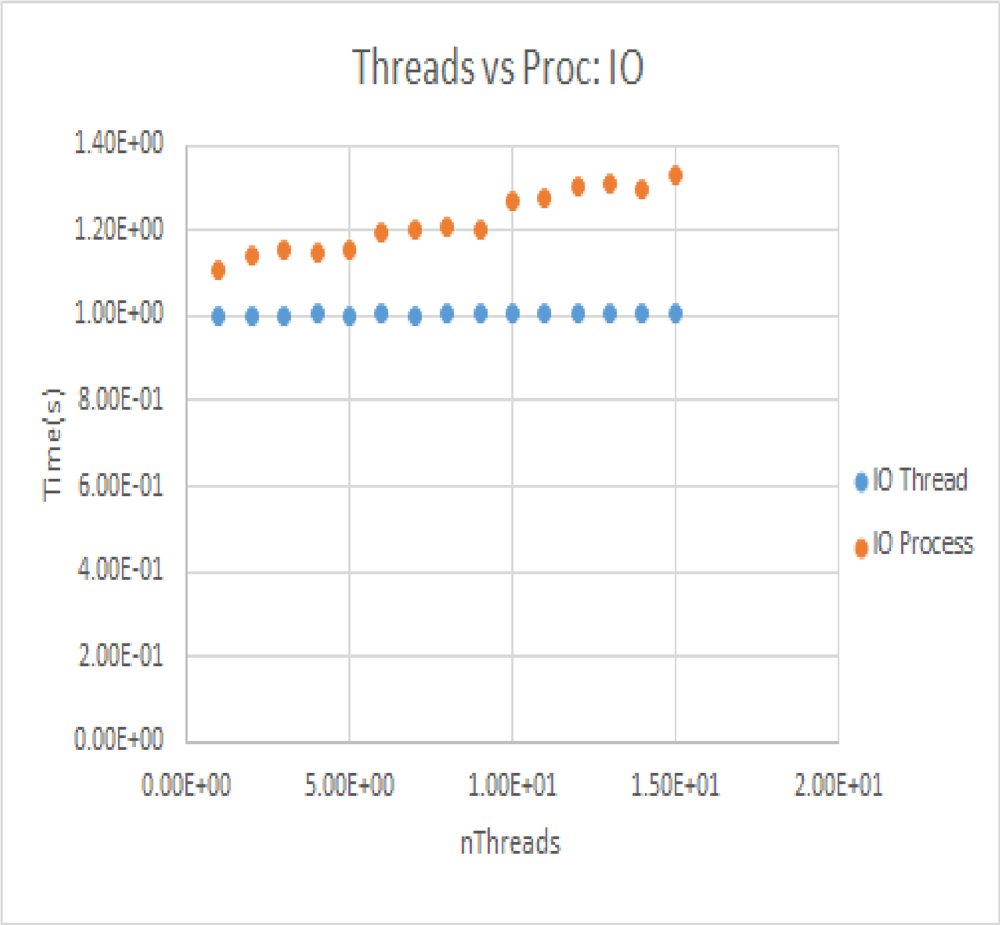
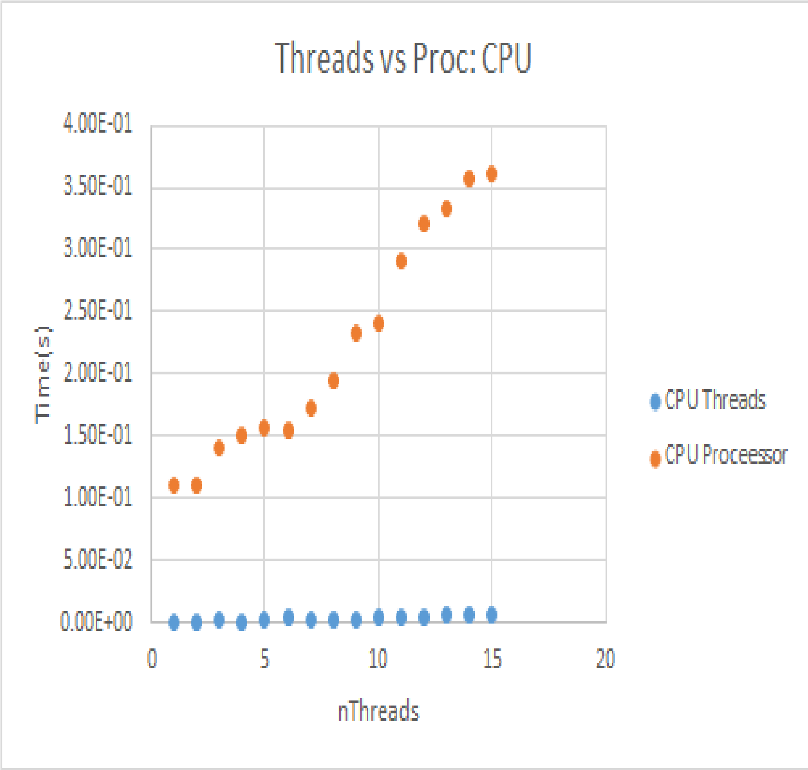

# Part 1

After Studying the following:
Python processes and subprocesses(https://docs.python.org/3/library/subprocess.html)
Python Threads(https://docs.python.org/3/library/threading.html)
Python Threads Versus Processes(https://stackoverflow.com/questions/3044580/multiprocessing-vs-threading-python)

We test the code provided in Python Threads Versus Processes(https://stackoverflow.com/questions/3044580/multiprocessing-vs-threading-python):

python .\ThreadVsProc.py 10

nthreads 	 CpuThread    CpuProcess   IoThread     IoProcess
1.000000e+00 0.000000e+00 1.116958e-01 1.002317e+00 1.110034e+00
2.000000e+00 9.973049e-04 1.116984e-01 1.002324e+00 1.137952e+00
3.000000e+00 1.996756e-03 1.406205e-01 1.002324e+00 1.153910e+00
4.000000e+00 9.975433e-04 1.505947e-01 1.003343e+00 1.145908e+00
5.000000e+00 2.994061e-03 1.575761e-01 1.002343e+00 1.157879e+00
6.000000e+00 3.994226e-03 1.555791e-01 1.003320e+00 1.193803e+00
7.000000e+00 1.994371e-03 1.735351e-01 1.002322e+00 1.198802e+00
8.000000e+00 2.979755e-03 1.944788e-01 1.004352e+00 1.210724e+00
9.000000e+00 2.992392e-03 2.323771e-01 1.004315e+00 1.203780e+00
1.000000e+01 4.985332e-03 2.413540e-01 1.004316e+00 1.266610e+00
1.100000e+01 3.987789e-03 2.902222e-01 1.004357e+00 1.279533e+00
1.200000e+01 4.989147e-03 3.201418e-01 1.004315e+00 1.305506e+00
1.300000e+01 5.990505e-03 3.321059e-01 1.005353e+00 1.307459e+00
1.400000e+01 6.981850e-03 3.570461e-01 1.006318e+00 1.298514e+00
1.500000e+01 5.986452e-03 3.610320e-01 1.005347e+00 1.332399e+00

Plotting the Data:

Then compare processes and threads:

### Multi-Processing

- Uses multiple Processes, that don't share memory, removing synchronization constraints
- Higher overhead
- Used for CPU bound tasks
- Child Processes can be killed

### Multi-Threading

- Uses multiple Threads, which share memory and so need to be careful when writing to the same memory
- Smaller overhead
- GIL may serialize in CPython
- Used for IO-bound Tasks

